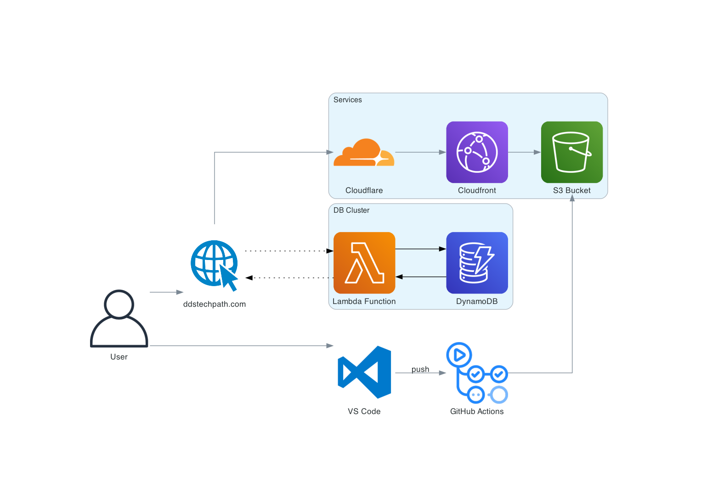

# Dylan Dominguez's Personal Website

Welcome to the repository for my personal website, [ddstechpath.com](http://ddstechpath.com).

## Overview

This project is a comprehensive demonstration of my skills in cloud engineering, web development, and continuous integration/continuous deployment (CI/CD). It is based on the Cloud Resume Challenge and showcases my ability to design, implement, and maintain a fully functional, cloud-hosted website.

## Architecture

## Hosting and Services

The following AWS services were used to host and manage the website:

1. **Cloudflare**: Provides DNS services and domain registration.
2. **AWS CloudFront**: A CDN that speeds up the delivery of your website content by caching it at edge locations around the world.
3. **AWS S3**: A scalable storage service used to host the static files of the website.
4. **AWS Lambda**: A serverless compute service that runs backend code in response to events and manages the visit counter API.
5. **AWS DynamoDB**: A fast and flexible NoSQL database service used to store and retrieve the number of visitors.
6. **GitHub Actions**: Automates the CI/CD pipeline, pushing code from VS Code to GitHub and then deploying it to the S3 bucket.

## CI/CD Pipeline

I implemented a CI/CD pipeline that seamlessly pushes code from my IDE (VS Code) to GitHub using GitHub Actions, and then deploys the changes to the S3 bucket hosting the site. This ensures that updates to the website are automated and efficient.

## Development

- **Frontend**: HTML, CSS, and JavaScript were used to build the site's interface.
- **Backend**: Python was used to develop the API with AWS Lambda.

## Learning Outcomes

This project has been instrumental in teaching me the foundational aspects of how the internet works, particularly in terms of manual cloud hosting. It has deepened my understanding of cloud infrastructure and reinforced my commitment to continuous learning in the field of internet and cloud technologies.

## Links

- [Personal Website](https://ddstechpath.com)
- [Cloud Resume Challenge](https://cloudresumechallenge.dev/)
